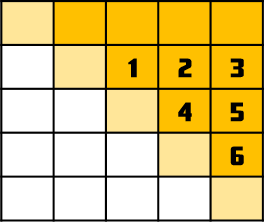

在考慮枚舉所有可行解的同時，若變數與變數之間有高度的相關性，那麼枚舉的順序就會變得相當重要。若我們用了錯誤的順序進行枚舉，很可能會浪費許多時間考慮根本不符合題目規定的解。

<include-problem title-prefix='例題 1：' path='/problem/cf/161/E'></include-problem>

因為 $p_i\le 99999$ 因此密碼鎖的大小至多只有 $5\times 5$。再加上對稱的關係，因此彼此不相關的格子只有對角線右上方的這 15 格：



但是，因為第一排已經固定了 $p_i$，所以剩下下面的 10 格。注意到，如果我們枚舉了標記數字 1 到 6 的地方，則每一排恰好空下一個對角線上的格子，而且彼此不相關。我們只要解決：有多少質數滿足 $\overline{aXbcd}$ 的形式，其中 $a,b,c,d$ 已知。而這一步可以預處理後 $O(1)$ 查詢。因此利用枚舉法的計算量約在 $10^6$，相當合理。

### 參考程式碼

```cpp
// by tmt514
#include <iostream>
#include <vector>
#include <string>
using namespace std;

// cnt[第k個位數被丟掉了][其他數字是多少] = 有幾個質數。
int cnt[5][100000];

void pre_compute() {
  // 先用篩法求質數。
  vector<int> sieved(99999, 0);
  for (int i = 2; i*i <= 99999; i++)
    for (int j = i*i; j <= 99999; j += i)
      sieved[j] = 1;
  // 對於找到的每一個質數，我們考慮中間每一個位數被挖空以後，剩下的數字，把他加進去。
  for (int p = 2; p <= 99999; p++)
    if (sieved[p] == 0)
      for (int ten = 1, k = 0; ten <= 10000; ten *= 10, k++)
        cnt[k][ p/(ten*10)*ten + p%ten ]++;
}

int ans, n;
int a[6][6];
int get_count(int x) {
  int prefix = 0;
  for (int i = 0; i < n; i++)
    if (i != x)
      prefix = prefix*10 + a[x][i];
  return cnt[n-1-x][prefix];
}
void dfs(int x, int y, int total) {
  if (x == n) {
    ans += total;
    return;
  }
  if (y == n) {
    dfs(x+1, 0, total * get_count(x));
    return;
  }

  if (x >= y) {
    a[x][y] = a[y][x];
    dfs(x, y+1, total);
  } else {
    for (int i = 0; i <= 9; i++) {
      a[x][y] = i;
      dfs(x, y+1, total);
    }
  }
}

void solve() {
  string s;
  cin >> s;
  n = s.size();
  for (int i = 0; i < n; i++) a[0][i] = (s[i]-'0');
  ans = 0;
  dfs(1, 0, 1);
  cout << ans << endl;
}

int main() {
  int T;
  pre_compute();
  cin >> T;
  while (T--) solve();
  return 0;
}
```

### 結論

先枚舉一部分的數值，並試圖留下一些完全不互相影響的待枚舉部分。如此一來，每一個獨立的部分可以各自用預處理的技巧快速找出答案。

-----

<include-problem title-prefix='例題 2：' path='/problem/cf/217/B'></include-problem>

-----

在第一個例題中，我們試圖降低未枚舉的格子之間的依賴關係。而在第二個例題中，我們試圖找出下一個要枚舉的操作與目前已枚舉部分的關聯，是為增加依賴關係。兩種方法的目的都是為了保證枚舉所花的時間大致與枚舉出的結果總數成正比，減少浪費的時間。

-----

## 練習題

